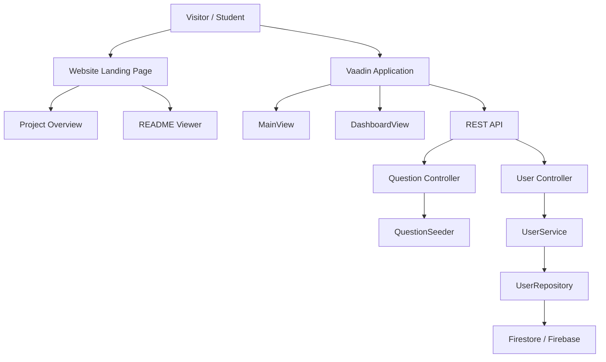
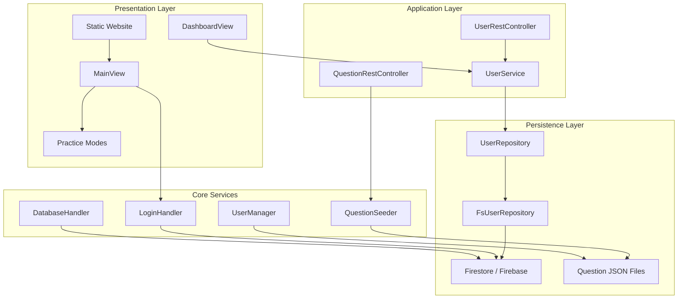
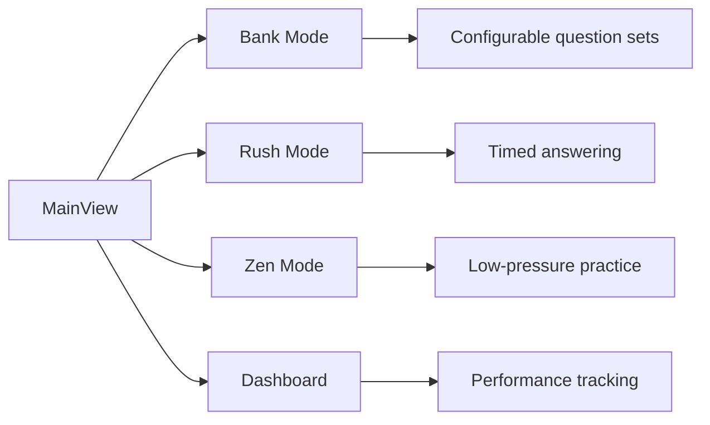
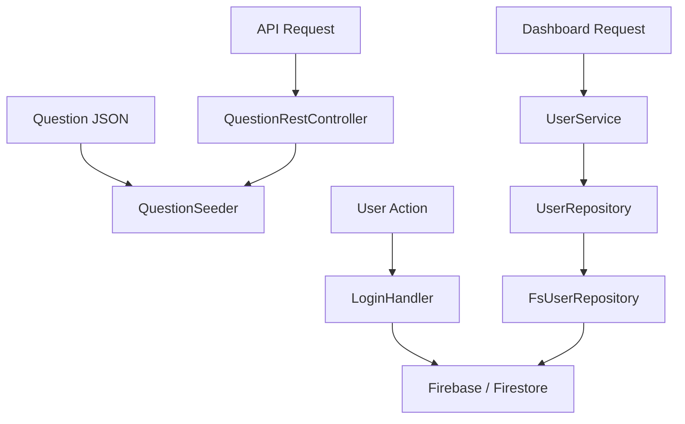

## Development - Alpha Stage
The codebase is currently in Version 1.0. This release is stable, but will no longer be receiving any future updates.

## Branches - Prod
Please check out the Prod branch for the latest updates. The main branch is only for stable pushes.

## Codebase
We are working under a tight timeframe and we hope to build and clean up once we get to the alpha release.

## Launch
This application is currently built to be a demo of Java REST technologies, as well as coding practices when developing a complex educational app with tight integration with Firebase and Vaadin for UI. Though this project could be used as a backend to power your educational software, please note that this project is archived and will NO LONGER be receiving any future updates. Security, as well as privacy of students must be maintained by the new project maintainer if you choose to base your application with Numerosity.

## Contributions
Contributions were welcome, but since the project is coming to an end, no more contributions will be accepted. 

---

# Numerosity Website

Numerosity is a math practice platform built around a modern Vaadin + Spring Boot application, Firebase-backed account and data support, and a lightweight public website for introducing the project.

This folder contains the public-facing static site for the project. It is intentionally simple, but it now documents the current system instead of the original prototype state.

---

### AI Useage Disclaimer
- Demo questions were generated with LLMS. Project development was also accelerated with the use of tools such as OpenAI Codex, Copilot, and other open source tools, though initially was mostly done by me.

---

## Project At A Glance

Numerosity is organized as a full-stack Java application with a web UI, REST endpoints, supporting services, and Firebase integration.



The general flow is:

- the static site explains the project
- the Vaadin UI handles the interactive application
- the REST layer exposes question and user operations
- Firebase stores user and application data when configured

---

## Current Application Structure

The live application code sits under `server/src/main/java/org/vaadin/numerosity/` and is split into several concerns.

### Entry Point

- `Application.java` - Spring Boot entry point
- `@PWA` metadata enables app-like behavior in supported browsers
- `@Theme(variant = "Lumo.dark")` sets the current default theme styling

### Main UI

- `MainView.java` - main landing view for the Vaadin app
- Provides top navigation, login dialog, and mode links
- Routes to the practice modes and dashboard

### Dashboard

- `ui/views/DashboardView.java` - user statistics and progress dashboard
- Displays score summaries and performance metrics
- Uses repository-backed data when the backend is configured

### REST API

- `rest/QuestionRestController.java` - question retrieval endpoints
- `rest/UserRestController.java` - user creation endpoint
- `rest/UserDTO.java` - request payload model

### Services And Data Access

- `service/UserService.java` - business layer for user operations
- `repository/UserRepository.java` - persistence contract
- `repository/FsUserRepository.java` - Firestore implementation
- `repository/exception/DbException.java` - repository error wrapper

### Supporting Subsystems

- `Subsystems/LoginHandler.java` - authentication and sign-in flow
- `Subsystems/QuestionSeeder.java` - question loading and seeding
- `Subsystems/QuestionContentLoader.java` - question content parsing
- `Subsystems/DatabaseHandler.java` - database-related coordination
- `Subsystems/FirebaseHandler.java` - Firebase initialization support
- `Subsystems/UserManager.java` - user information and answer tracking

### Math And Practice Features

- `Featureset/AppFunctions/bank.java` - configurable practice mode
- `Featureset/AppFunctions/rush.java` - timed rush mode
- `Featureset/AppFunctions/zen.java` - relaxed study mode
- `Featureset/Supporter/OptionButton.java` - reusable answer option component

#### Math Engine Tests

The `server/src/test/java/org/vaadin/numerosity/Featureset/MathEngine/` directory contains unit tests for the math utilities:

- `AlgebraOneTest.java` - tests for linear functions, systems, quadratic vertex, and slope calculations
- `AlgebraTwoTest.java` - tests for quadratic equations, polynomial evaluation, sequences, and logarithms
- `CalculusTest.java` - tests for derivatives, integrals, Riemann sums, and limit approximations
- `GeometryTest.java` - tests for area, perimeter, triangle, and polygon calculations
- `PrecalculusTest.java` - tests for trigonometric functions, coordinate conversions, vectors, and combinatorics

---

## Architecture

### Layered View



### Runtime Flow

1. A user opens the static website or the Vaadin app.
2. The frontend routes the user into the correct view.
3. The UI asks services for user, question, or dashboard data.
4. Services delegate to repositories and supporting subsystems.
5. Firebase is used when credentials are present; otherwise the app can run in demo mode for some flows.

---

## Backend Features

### Application Entry

The backend is a Spring Boot application launched by `Application.java`.

### Configuration

The app reads Firebase configuration from `server/src/main/resources/application.properties`.

Important properties:

- `firebase.project.id`
- `firebase.credentials.path`
- `vaadin.launch-browser=true`
- `server.port=${PORT:8080}`

### Firebase Behavior

The backend uses a flexible configuration strategy:

- if real credentials are present, Firebase and Firestore are initialized
- if credentials are missing or incomplete, the app can fall back to demo mode for unsupported features
- `ApplicationConfig` and `FirebaseInitializer` both participate in startup behavior

### REST Endpoints

The main API surface currently includes:

- `GET /api/questions`
- `GET /api/questions/category/{category}`
- `GET /api/questions/difficulty/{difficulty}`
- `GET /api/questions/random`
- `GET /api/users`
- `POST /api/users`

### Dashboard

The dashboard view surfaces user progress metrics such as:

- total correct answers
- total incorrect answers
- accuracy rate
- streak / pace indicators
- average time per question
- number of questions answered

---

## Practice Modes

The application currently exposes three main practice modes from the Vaadin home view.



### Bank Mode

- Lets users configure a question session
- Intended for targeted practice by topic and difficulty
- Best for structured study sessions

### Rush Mode

- Focuses on fast-paced answering
- Tracks score during a session
- Suited for speed and recall training

### Zen Mode

- Offers a calmer practice experience
- Emphasizes learning over scoring pressure
- Useful for review and concept reinforcement

---

## Data Model And Storage

### User Data

The project stores user information and performance stats through a repository abstraction.

Typical user-related data includes:

- user ID
- username
- correctness counts
- wrong answer counts
- other tracked performance values

### Question Data

Question data is loaded from JSON resources and seeded into the application flow.

Relevant files include:

- `server/src/main/resources/data/questions-comprehensive.json`
- `server/Database/Bank/questions.json`
- `server/Database/Bank/questions-comprehensive.json`

### Storage Path



---

## Running Locally

### Static Website

If you want to view this website on its own, serve the `server/website/` directory with a local static file server and open `index.html`.

The README viewer works best when the markdown file is served from the same directory.

### Full Application

From `server/`, run the main app with Maven or your IDE.

Common local URLs:

- `http://localhost:8080/` - main application
- `http://localhost:8080/dashboard` - dashboard
- `http://localhost:8080/api/questions` - questions API
- `http://localhost:8080/api/users` - user API

### Firebase Setup

To enable full backend features, configure Firebase credentials and project ID in `application.properties`.

If Firebase is not configured:

- the app may still start
- some persistence-backed features will be limited
- demo or fallback behavior may be used in places where supported

---

## Repository Layout

```text
server/
├─ docs/
│  ├─ API.md
│  ├─ ARCHITECTURE.md
│  └─ SETUP.md
├─ src/
│  ├─ main/
│  │  ├─ java/org/vaadin/numerosity/
│  │  │  ├─ Application.java
│  │  │  ├─ MainView.java
│  │  │  ├─ config/
│  │  │  ├─ entity/
│  │  │  ├─ Featureset/
│  │  │  ├─ repository/
│  │  │  ├─ rest/
│  │  │  ├─ service/
│  │  │  ├─ Subsystems/
│  │  │  └─ ui/
│  │  └─ resources/
│  │     ├─ application.properties
│  │     └─ data/
│  └─ test/
├─ website/
│  ├─ index.html
│  ├─ styles.css
│  ├─ script.js
│  ├─ physics.js
│  └─ README.md
└─ target/
```

---

## Maintainer Notes

- Keep this README aligned with the live `server/` codebase.
- Prefer describing the actual implemented routes and classes over the original prototype plan.
- Update the diagrams whenever the backend structure or public routes change.
- If the website gains new pages or controls, add them to the file and behavior sections above.

---

## Quick Summary

Numerosity is now a structured math practice platform with:

- a polished public website
- a Vaadin-based application
- REST endpoints for data access
- Firebase-backed persistence when configured
- dashboards and multiple practice modes